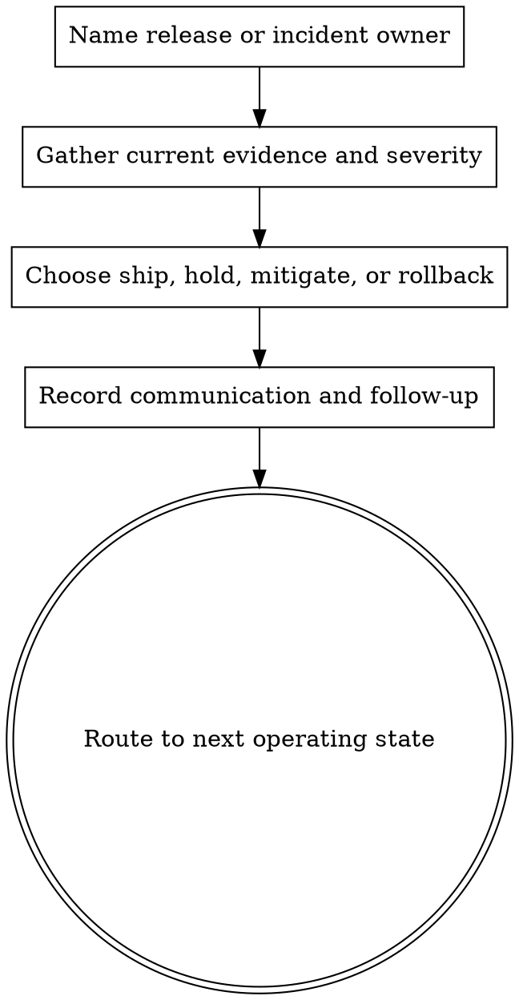

# Release And Operations

## Overview

Ship only from current evidence and a clear rollback story.

**Core principle:** if runtime readiness, rollback ownership, or open risk is vague, the change is not ready to ship.

Guide completion of development work by presenting clear options and handling the chosen integration workflow.

<HARD-GATE>
Do not ship or stay in incident mode without a named owner, current severity, and next update or follow-up action.
</HARD-GATE>

<NON-NEGOTIABLE>
Every run must declare its exact local `assets/` and `references/` set before execution, read the required files before deciding ship, hold, mitigate, or rollback, and record why each declared file was loaded.
Unnamed support files are out of contract and must not be relied on.
If no support files are needed, say `none` explicitly. Final outputs must report the declared set, the files actually read, and the files actually used.
</NON-NEGOTIABLE>

<ANTI-PATTERN>
Do not collapse release, incident response, and stakeholder communication into one vague status blob. Each needs a distinct record.
</ANTI-PATTERN>

<NON-NEGOTIABLE>
Do not let build success, one green check, or old staging notes stand in for current release evidence. Readiness requires fresh runtime evidence, explicit risk level, and a workable rollback path.
</NON-NEGOTIABLE>

<OWNER-BOUNDARY>
Do not redesign implementation or product scope from inside release operations.
Release owns current evidence, rollout and rollback choice, user-impact posture, and follow-up cadence; remediation design belongs to implementation, planning, or product owners.
</OWNER-BOUNDARY>

<WORKSPACE-GATE>
isolated_workspace_readiness_must_be_checked_before_execution_or_release_completion.
</WORKSPACE-GATE>

<BRANCH-EXIT-GATE>
branch_finish_requires_explicit_option_selection_after_fresh_verification.
</BRANCH-EXIT-GATE>

## When to Use

- deciding whether accepted work can ship
- checking rollout, rollback, or environment readiness
- reviewing operational follow-up after deployment
- handling release gating or post-release monitoring expectations
- coordinating incident response, user-facing status, or post-incident prevention work
- converting verification and runtime signals into a ship or hold decision
- checking whether observability, health checks, and support paths are ready before rollout

Trigger this skill immediately when:

- accepted work is near ship/no-ship and rollback ownership must be explicit
- runtime degradation, launch instability, or an incident shifts the problem from build to operate
- the next decision is ship, hold, mitigate, rollback, or monitor rather than implement
- external communication cadence or post-incident follow-up is part of the work

## Do Not Use

- early planning or design
- implementation work that still lacks review
- generic review that belongs in `quality-and-review`

## Process Flow



## Procedure

```text
STEP_0 := declare(support_files := exact assets/ + references/ set OR none)
STEP_0A := read(required_assets_and_references_before_operating_decision)
STEP_0B := record(why_each_declared_file_was_loaded)
STEP_1 := identify(ship_candidate, release_owner)
STEP_2 := gather(verification_status, risk_level, unresolved_defects, runtime_notes, observability, rollout_shape, rollback_owner, rollback_method, worktree_or_workspace_path, workspace_isolation_status, evidence_source, uncertainty_label)
STEP_3 := choose(decision := ship OR ship_with_follow_up OR hold OR do_not_ship OR mitigate_and_monitor OR rollback OR merge_locally OR create_pr OR keep_branch_as_is OR discard_with_confirmation)
STEP_4 := choose(cheapest_safe_rollout_path)
STEP_5 := record(open_risk_profile, current_user_impact, first_follow_up_action, branch_disposition_option, monitoring_owner, evidence_timeframe, next_signal_review_time, threshold_trigger, threshold_action, sustainability_note_when_operationally_material, sustainability_decision_or_mitigation)
STEP_5A := record(signal_threshold_matrix := signal + source + baseline_window + comparison_window + threshold_shape + threshold_value_or_binary_trigger + action_owner + review_time + stop_condition) IF ship_or_monitoring_depends_on_runtime_signals
STEP_5B := record(sustainability_decision_matrix := materiality_class + impact_vector + impact_horizon + evidence_basis + decision_class + mitigation_or_measurement + decision_owner + review_time) IF operational_sustainability_shift_is_plausible

IF risk_level = medium OR risk_level = high THEN
  record(before_after_state, exact_rollback_instructions, recovery_verifier)

IF evidence_is_weak THEN
  STOP("diagnose missing readiness evidence before shipping")

IF workspace_isolation_status IS weak AND execution_or_cleanup_depends_on_isolated_workspace THEN
  STOP("verify workspace readiness before continuing")

IF current_mode = incident_response THEN
  record(next_status_update_time, external_communicator, prevention_follow_up)
  ROUTE -> release-and-operations
```

## Branch Exit Options

After fresh verification, present explicit integration choices:

1. Merge back locally
2. Push and create a PR
3. Keep the branch as-is
4. Discard the work

Do not collapse these into vague next steps.

Rules:
- Do not proceed with failing tests
- Verify tests before offering options
- For destructive discard, require explicit confirmation
- Clean up isolated workspace only when the chosen option permits it

## Operating Modes

- `release gate`: can this change ship?
- `launch monitor`: is the launch stable and are follow-up actions clear?
- `incident response`: what is the current severity, mitigation, and communication cadence?
- `post-incident`: what evidence, learnings, and preventive actions must be recorded?
- `operational readiness`: are environment, observability, health, and rollback mechanics ready enough for rollout?

## Choose Roles

- use `agents/release-manager.md` when the main question is go/no-go or next operating state
- use `agents/devops.md` when rollout shape, rollback mechanics, runtime readiness, or environment constraints dominate
- use `agents/qa.md` when shipping confidence still depends on fresh verification clarity
- use `agents/security-privacy.md` when the release or incident has trust, privacy, or policy implications

## Choose Assets

```text
IF default_ship_decision THEN START -> assets/release-gate.md
ELSE IF readiness_evidence_is_weak THEN SWITCH -> assets/release-review-checklist.md OR assets/launch-readiness-checklist.md
ELSE IF rollback_path_must_be_named THEN SWITCH -> assets/rollback-record.md
ELSE IF runtime_posture_matters_more_than_code_detail THEN SWITCH -> assets/operational-readiness.md OR assets/operational-health-snapshot.md
ELSE IF threshold_logic_or_post_launch_iteration_is_the_main_risk THEN SWITCH -> assets/signal-threshold-matrix.md
ELSE IF sustainability_materiality_or_operational_efficiency_tradeoff_is_the_main_risk THEN SWITCH -> assets/sustainability-decision-matrix.md
ELSE IF current_mode = incident_response THEN SWITCH -> assets/incident-status-update.md
ELSE IF current_mode = post_incident THEN SWITCH -> assets/post-incident-summary.md
ELSE IF handoff_owner_changes THEN SWITCH -> assets/mail-handoff.md
ELSE STOP("pick the asset that matches the operating mode")
```

## Choose References

```text
IF deciding_ship_readiness THEN READ -> references/release-evidence.md
ELSE IF rollout_path_depends_on_change_shape THEN READ -> references/rollout-shape-selection.md
ELSE IF system_is_degraded THEN READ -> references/incident-response-baseline.md
ELSE IF follow_up_cadence_is_fuzzy THEN READ -> references/launch-and-operate-cadence.md
ELSE IF status_wording_is_risky THEN READ -> references/ops-reporting-rules.md
ELSE IF environment_is_capacity_constrained THEN READ -> references/low-ram-deployment-baseline.md
ELSE STOP("no narrower release reference matches")
```

## Role By Phase Coverage

- `release manager`: go or no-go routing
- `DevOps`: rollout, rollback, and runtime readiness
- `QA`: current verification confidence
- `CTO` or approver: final decision ownership when required

## Optional Multi-Agent Use

Use `multi-agent-orchestration` when release readiness needs coordinated QA, DevOps, security, and approver input. Keep it single-agent when one owner can assemble the whole decision quickly.

## Output Contract

Return a release record with:

- declared support files
- files read before the operating decision
- why each file was loaded
- ship candidate
- change type and risk level
- current evidence
- rollout shape
- current severity or incident state, if applicable
- open risks
- evidence source and uncertainty label
- rollback owner
- rollback method
- monitoring owner
- next signal review time
- threshold trigger and threshold action
- signal threshold matrix when ship or monitor depends on runtime signals
- sustainability decision matrix when operational sustainability is plausibly material
- sustainability decision or mitigation when material
- decision
- explicit branch exit option
- first follow-up action
- next update or review time
- files actually used

## Selection Rules

Use these assets and references by operating mode:

- start with `assets/release-gate.md` for the canonical go, hold, mitigate, or rollback decision on a ship candidate.
- add `assets/operational-readiness.md` when environment, ingress, runtime capacity, or verification method still needs to be checked before ship.
- add `assets/release-review-checklist.md` for final release gating across verification, security, approvals, and rollout notes.
- add `assets/rollback-record.md` when rollback is possible enough to describe, test, or execute explicitly.
- use `assets/operational-health-snapshot.md` for current-state monitoring after ship or during degraded operation.
- use `assets/incident-status-update.md` when an unresolved incident needs a current status and next update time.
- use `assets/post-incident-summary.md` after stabilization to capture cause, mitigation, and prevention work.
- use `assets/launch-readiness-checklist.md` when a launch window needs preflight confirmation beyond code acceptance.
- use `assets/mail-handoff.md` only when the operating decision is being transferred through an explicit request or response thread.
- use `references/release-evidence.md` when deciding whether evidence is fresh enough to ship.
- use `references/incident-response-baseline.md` when the system is degraded and incident handling is active.
- use `references/launch-and-operate-cadence.md` when monitoring and follow-up ownership around launch are still vague.
- use `references/ops-reporting-rules.md` when status reporting quality is part of the operational risk.
- use `references/low-ram-deployment-baseline.md` when the target host is capacity-constrained or build-sensitive.

## Supporting Assets

Local Roles:
- `agents/release-manager.md`
- `agents/devops.md`
- `agents/qa.md`
- `agents/security-privacy.md`

Local Assets:
- `assets/release-gate.md`
- `assets/release-review-checklist.md`
- `assets/mail-handoff.md`
- `assets/rollback-record.md`
- `assets/operational-readiness.md`
- `assets/incident-status-update.md`
- `assets/post-incident-summary.md`
- `assets/operational-health-snapshot.md`
- `assets/launch-readiness-checklist.md`

Local References:
- `references/release-evidence.md`
- `references/rollout-shape-selection.md`
- `references/incident-response-baseline.md`
- `references/launch-and-operate-cadence.md`
- `references/ops-reporting-rules.md`
- `references/low-ram-deployment-baseline.md`

## Promote Recurring Lessons

- release gate rules -> `SKILL.md`
- operational role behavior -> `agents/*.md`
- reusable release records -> `assets/*.md`
